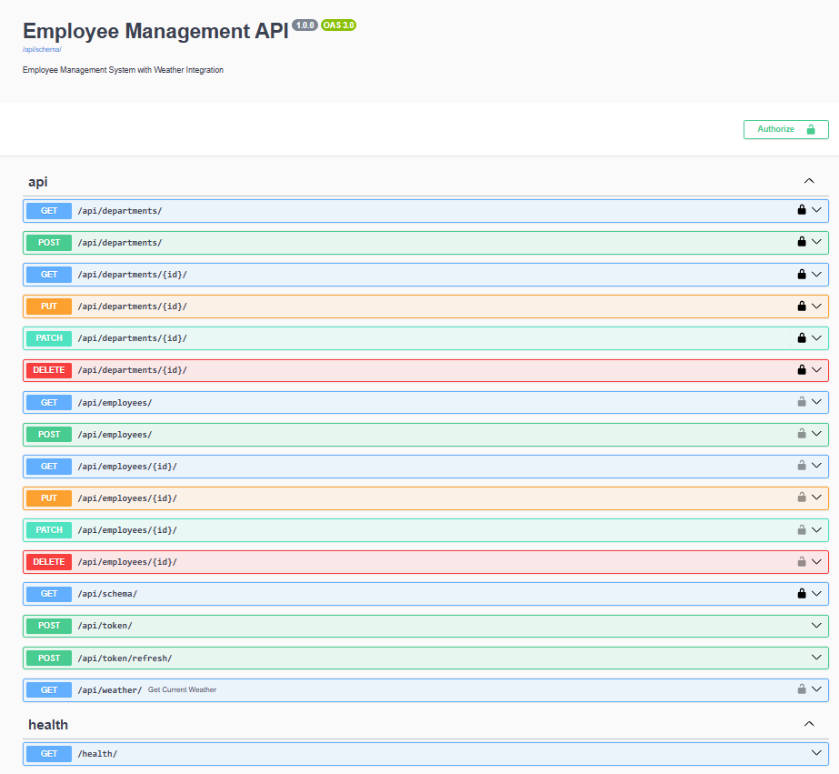
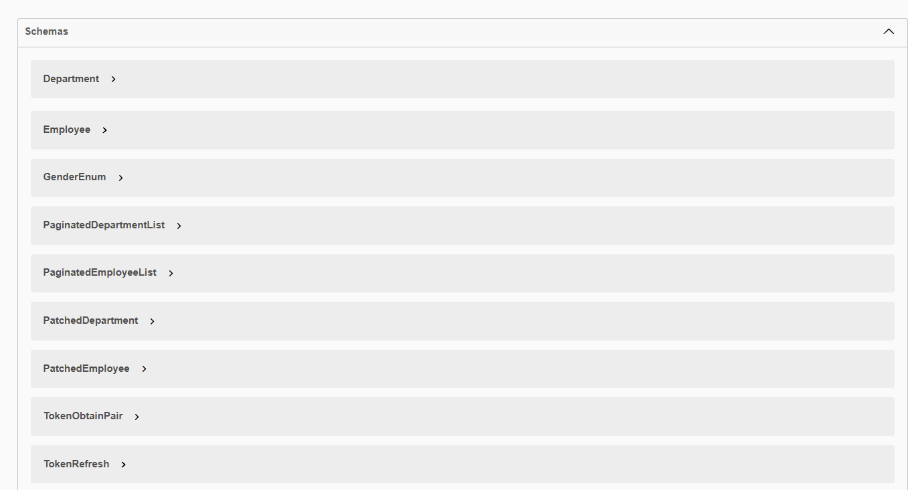
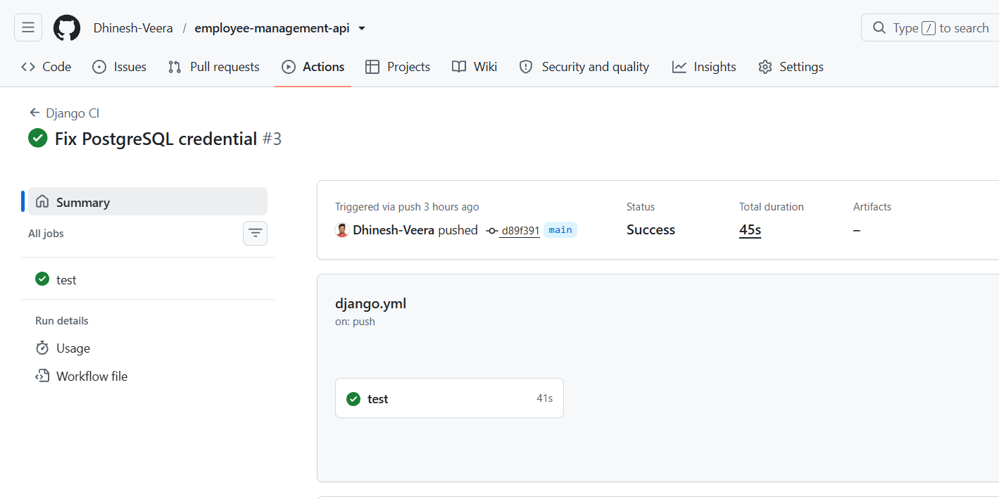
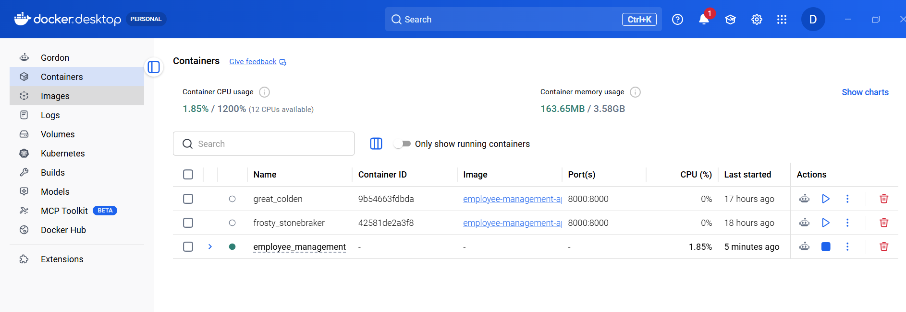
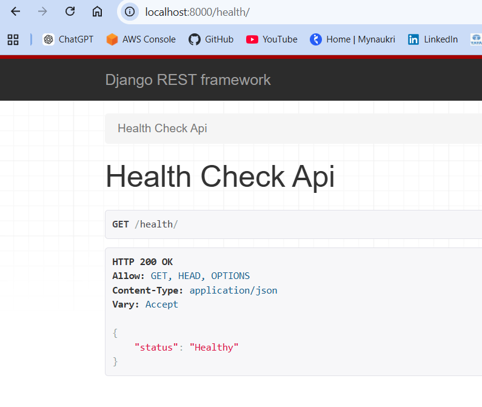

# Employee Management API

## Overview

A Django REST Framework application for employee management with external weather integration.

## Features

- Employee CRUD APIs
- JWT Authentication
- Weather API Integration
- Docker & Docker Compose
- PostgreSQL
- GitHub Actions CI
- Swagger/OpenAPI Documentation
- Health Check API
- Structured Logging
- Unit Testing

## Tech Stack

- Python 3.12
- Django
- Django REST Framework
- PostgreSQL
- Docker
- Docker Compose
- GitHub Actions
- drf-spectacular

## Project Structure

config/
employees/
weather/
common/

## Setup

git clone ...

pip install -r requirements.txt

cp .env.example .env

python manage.py migrate

python manage.py runserver

## Docker

docker compose up --build

## API Documentation

/api/docs/

/api/schema/

## Health API

GET /health/

## CI/CD

GitHub Actions automatically:

- Installs dependencies
- Runs tests
- Validates project

## Author

Dhinesh V

## Example APIs

- Create Employee
  -     POST /api/employees/
- Get Employees
  -     GET /api/employees/
- Weather
  -     GET /api/weather/?city=Chennai
- Health
  -     GET /health/

## Architecture Diagram
                Client
                   │
                   ▼
          Django REST API
         ┌──────┴──────┐
         ▼             ▼
 Employees      Weather Service
         │             │
         ▼             ▼
 PostgreSQL     OpenWeather API

         ▲
         │
 Docker Compose

         ▲
         │
 GitHub Actions

 ## Swagger UI

 ## GitHub Actions passing

## Docker containers running

## Health endpoint

## API Examples
- GET /health/
  - Response
    -   {"status": "healthy"}